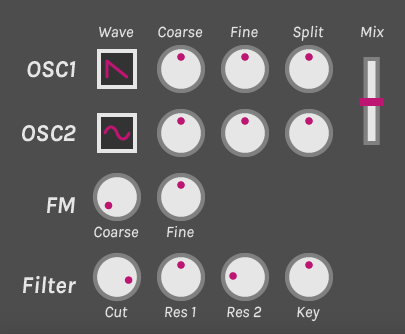
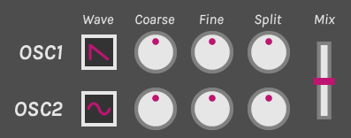
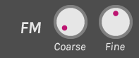
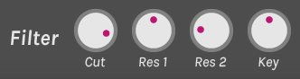
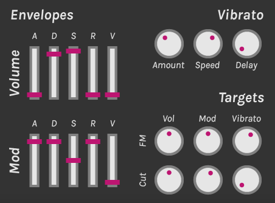
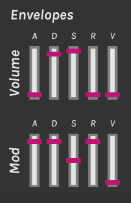

# Mika Micro manual

## Installation

Place the .dll file in your VST plugins folder and set up your DAW to load plugins from that folder. If you don't have a VST plugins folder yet, choose any folder you like.

## Usage

To play Mika Micro, use your host to send MIDI input to the plugin. To change the sound, use your mouse to manipulate the controls. Switches can be operated by clicking them, and knobs and sliders can be operated by clicking and dragging them up or down. Every control can be reset to its default value by double clicking it.

### Generators

The left side of the synth is the **generators** section, responsible for creating and shaping synth sounds.

#### Oscillators

The oscillators are the basic building blocks of a sound in Mika Micro.

##### Controls
Mika Micro has two oscillators, each with the same controls:
- **Waveform**: choose what sound the oscillator will produce. The available waveforms are sine, triangle, saw, square, pulse, and noise.
- **Coarse**: sets the pitch of the oscillator in semitones.
- **Fine**: fine tunes the pitch in a range of -1 to +1 semitones.
- **Split**: splits the oscillator into two slightly detuned oscillators, creating a thicker sound. When turned to the left, the oscillators will start out of phase, creating a soft, gentle attack. When turned to the right, the oscillators will start in phase, creating a punchy, hard attack.

The **mix** control on the right sets the volume balance between the two oscillators. If the control is set all the way to oscillator 1 or 2, the other oscillator will be disabled, saving CPU cycles.

#### FM

You can use the FM section to modulate the frequency of either oscillator by the output of the FM oscillator, which outputs a sine wave at oscillator 1's frequency. If you don't know what that means, that's OK! Just play with the knobs and see what happens.

##### Controls
- **Mode**: cycles between off, mode 1, and mode 2. In mode 1, oscillator 1's output is multiplied by the FM oscillator. In mode 2, oscillator 2's output is multiplied by the FM oscillator.
- **Coarse**: sets the amount of frequency modulation to apply.
- **Fine**: fine tunes the amount of frequency modulation.

#### Filter

When enabled, the low pass filter removes high frequencies from the sound, resulting in a darker, more subdued sound. The resonance knob adds a "ringing" sound, which is a commonly used effect in electronic music.

##### Controls
- **Enabled**: turns the filter on or off. 
- **Cutoff**: sets the cutoff frequency. The farther to the left the knob is turned, the darker the sound.
- **Resonance**: creates a ringing sound around the cutoff frequency.
- **Key tracking**: adjusts the cutoff proportionally (right) or inversely (left) with the pitch of the voice. When turned all the way to the right, the filter will affect the timbre of every note equally.

### Modulation

The right half of the synth is the **modulation** section, responsible for creating movement in the synth. The three modulation sources - the **volume envelope**, the **mod envelope**, and **vibrato** - can all be linked to the FM amount or filter cutoff using the knobs in the **targets** section.

#### Envelopes

Mika Micro has two envelopes, which modulate parameters along a certain path every time a note is started. The **volume** envelope controls the volume of the sound, while the **modulation** envelope is not linked to any parameters by default.

##### Controls
Both envelopes have the same controls:
- **Attack**: the time it takes for the envelope to move from 0% to 100% when a note is played.
- **Decay**: the time it takes for the envelope to move from 100% to the sustain level.
- **Sustain**: the level the envelope rests at until the note is released.
- **Release**: the time it takes for the envelope to move to 0% when the note is released.
- **Velocity sensitivity**: the amount the total value of the envelope is scaled by the velocity the note is played at.

#### Vibrato

The vibrato section adds a vibrato effect to each voice.

##### Controls
- **Amount**: the amount of vibrato to apply. Turn the knob to the left to apply vibrato to both oscillators 1 and 2. Turn it to the right to apply vibrato to oscillator 2 only.
- **Speed**: sets the speed of the vibrato.
- **Delay**: sets the amount of time it takes for the vibrato to activate fully after a note is played.

### Master

The bottom bar has a few more controls:
- **Mono**: switches between mono 1 (retrigger), mono 2 (legato), and poly.
- **Glide**: In mono mode, if a key is pressed while another is already held down, the pitch of the voice will glide up to the new note. The glide knob sets the speed at which these glides occur.
- **Volume**: the volume of the final output signal.