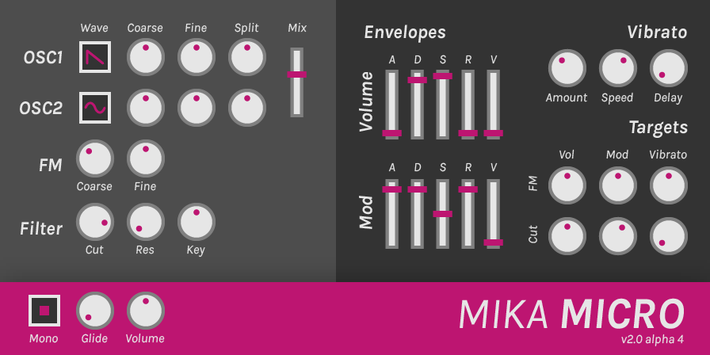

# Mika Micro

Mika Micro is a subtractive synthesizer plugin that aims to be fun and expressive with a minimal set of controls.

Features:
- 2 oscillators with 5 waveforms and split knobs
- Simple FM functionality
- Resonant low pass filter
- 8 voice polyphony and legato mode

## Contributing

Feel free to give feedback on design, report bugs, make pull requests, etc. I like all sorts of involvement!

### Building Mika Micro

1. Clone [wdl-ol](https://github.com/olilarkin/wdl-ol).
2. Add the necessary include files for the build targets you want to use. See [Martin Finke's tutorial](http://www.martin-finke.de/blog/articles/audio-plugins-002-setting-up-wdl-ol/) for more information.
3. Clone the mika-micro repo into the wdl-ol base directory.
4. Open MikaMicro.sln in Visual Studio and build the project for the desired target.
